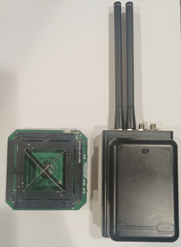
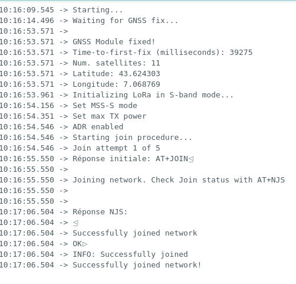
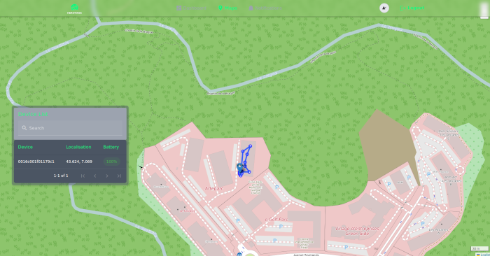

# Projet Objet Connecté : CubeSat et NewSpace

## Table des matières
- [Description](#description)
- [Matériel Utilisé](#matériel-utilisé)
- [Architecture Matérielle](#architecture-matérielle)
- [Développement](#développement)
- [Architecture Logicielle](#architecture-logicielle)
- [Architecture du Système](#architecture-du-système)
- [Fonctionnalités Principales](#fonctionnalités-principales)
- [Structure du Payload](#structure-du-payload-de-données-transmises-par-le-terminal-echostar)
- [Résultats](#résultats)
- [Perspectives](#perspectives)

## Description
Ce projet consiste en le développement d'un système de **tracking GPS** intégrant des **données environnementales**. La transmission des informations se fait via une **liaison satellitaire** avec **EchoStar 21**.
Les données sont ensuite traitées et envoyées vers une plateforme pour une visualisation en **temps réels** à l'aide de **dashboard**.

## Matériel Utilisé

- Terminal EchoStar (fourni par le **LEAT**) avec :
	* Module radio **EM2050** pour la communication satellite (protocole **LoRaWAN** avec la couche physique **LR-FHSS** (Long Range Frequency Hopping Spread Spectrum))
	* Capteur BME280 pour les données environnementales
- **PlutoSDR** pour l'analyse du signal
- Antenne **2GHz** pour la réception

## Architecture Matérielle
Le système s'articule autour d'un microcontrôleur qui coordonne les différents composants :
```
┌─────────────────────────────────────────┐
│             Microcontrôleur             │
└─┬─────────┬────────────┬────────────┬───┘
  │         │            │            │
  ▼         ▼            ▼            ▼
┌─────┐  ┌──────┐   ┌─────────┐  ┌─────────┐
│GNSS │  │BME280│   │EM2050   │  │Batterie │
│     │  │Sensor│   │LoRa FHSS│  │Mesure   │
└─┬───┘  └──┬───┘   └────┬────┘  └────┬────┘
  │         │            │            │
  │         │            │            │
  ▼         ▼            ▼            ▼
Position  Données     Transmission  Tension
         Environ.     Satellite
```
## Développement
Le projet a été développé en plusieurs parties :
1. Programmation Arduino :
	- Configuration de la communication LoRaWAN (en **bande S**)
	- Implémentation du système de tracking
	- Collecte des données environnementales
2. Visualisation du signal :
	- Utilisation de **GNU Radio** et de la **PlutoSDR** pour l'observation des signaux envoyés par le terminal EchoStar

3. Récupération et traitement des données pour la visualisation sur un dashboard
	- Utilisation d'un **client MQTT** sur mesure pour souscrire au topic 
	- Traitement des données avec notre backend (crée avec **Node.js**)
	- Stockage des données dans **InfluxDB**
	- Envoi vers notre **dashboard** à l'aide d'une **API REST** sur mesure pour une **visualisation en temps réel**.

## Architecture Logicielle
### Initialisation du système

### Boucle principale


## Architecture du Système
```
┌────────────────┐
│ Terminal EM2050│
│[Capteurs+Radio]│
└───────┬────────┘
        │
        ▼
┌───────────────┐     ┌─────────────┐     ┌─────────────────┐       ┌───────────┐
│  EchoStar XXI │     │  Internet   │     │     Backend     │       │  Frontend │
│   [Satellite] │──→  │[Broker MQTT]│──→  │  [Client MQTT]  │←───→  │[Dashboard]│
└───────────────┘     └─────────────┘     └────────┬────────┘       └─────┬─────┘
                                                   │                      │
                                                   │                      │
                                                   ▼                      │
                                         ┌───────────────┐                │
                                         │ [Parser JSON] │                │
                                         └───────┬───────┘                │
                                                 │                        │
                                                 ▼                        │
                                         ┌───────────────┐                │
                                         │   [InfluxDB]  │◄───────────────┘
                                         └───────────────┘
```
## Fonctionnalités Principales
- Tracking GPS en temps réel
- Monitoring environnemental :
	* Température
	* Humidité
	* Pression atmosphérique
- Visualisation des données :
	* Position et trace sur carte
	* Graphiques des données environnementales
	* Graphiques qualité du signal (RSSI, SNR)
- Analyse du signal émit avec GNU Radio :
       * Observation du signal LR-FHSS dans la bande S ( ~ 2.0097 GHz)
       * Visualisation du signal via spectrogramme waterfall montrant une transmission continue
       * Analyse spectrale avec une FFT          

## Structure du Payload de Données Transmises par le Terminal Echostar

### Capteurs Environnementaux  
| Champ      | Taille (bytes) | Description                           |
|------------|--------------|---------------------------------------|
| Température | 2            | Température en centièmes de degré (°C × 100) |
| Humidité    | 1            | Humidité relative en % × 2           |
| Pression    | 2            | Pression atmosphérique en hPa × 10   |

### Données GNSS  
| Champ      | Taille (bytes) | Description                            |
|------------|--------------|----------------------------------------|
| Latitude   | 3            | Latitude encodée sur 3 bytes (0.0001° précision) |
| Longitude  | 3            | Longitude encodée sur 3 bytes (0.0001° précision) |
| Altitude   | 3            | Altitude en mètres (précision 0.01 m)  |
| Satellites | 1            | Nombre de satellites GNSS utilisés     |

### Données Système  
| Champ      | Taille (bytes) | Description                           |
|------------|--------------|---------------------------------------|
| Batterie   | 2            | Niveau de batterie en mV              |
| TTF        | 1            | Time-To-Fix GNSS                      |
| Vitesse    | 1            | Vitesse en m/s                        |
| Puissance  | 1            | Puissance de transmission en dBm      |
| SNR        | 1            | Rapport Signal/Bruit (SNR / 4)        |
| RSSI       | 1            | Intensité du signal reçu (RSSI négatif) |

### Taille totale : **22 octets**

## Résultats
### Logs série Arduino : Initialisation et Boucle principale 
          
  
### Screenshots dashboard
 
 
                                    
## Perspectives

- Ajout de nouveaux capteurs
- Extension des fonctionnalités du dashboard 
- Intégration d'API externe
                        
